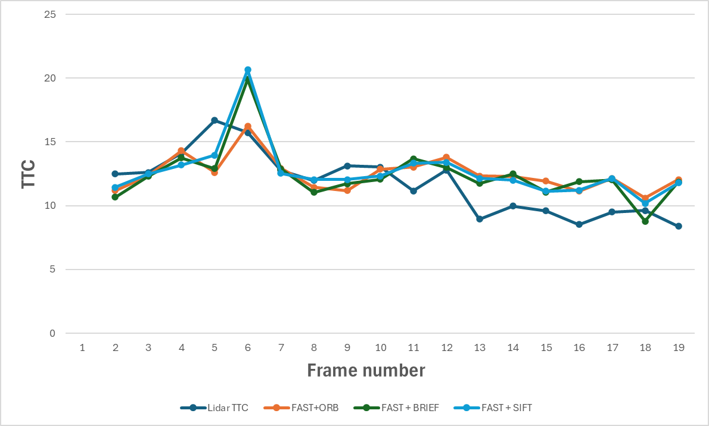

# SFND_Lidar_Camera_TTC_Estimation_FINAL_Project-Report

FP.1)Bounding Box Matching
The matchBoundingBoxes function establishes correspondences between bounding boxes in consecutive frames based on keypoint matches.

Steps and implementation:

1)Iterate over keypoint matches
Where: for(auto it1=matches.begin(); it1!=matches.end(); it1++)
What it does: For each matched keypoint between the previous (prevFrame) and current (currFrame) frames, the function retrieves the corresponding cv::KeyPoint objects (keyprev and keycurr).

2)Associate keypoints with bounding boxes
Where: Nested loops over prevFrame.boundingBoxes (it2) and currFrame.boundingBoxes (it3)
What it does: Checks if the keypoints fall within the ROI of any bounding box. If so, it records the pair of bounding box IDs in a multimap bbmatches.

3)Count the number of keypoint matches per bounding box pair
Where: for(auto it4=prevFrame.boundingBoxes.begin(); it4!=prevFrame.boundingBoxes.end(); it4++)
What it does: For each bounding box in the previous frame, counts how many keypoints matched with each bounding box in the current frame using currcount.

4)Select the best-matching bounding box
Where: Loop over currcount inside the previous loop
What it does: Determines the bounding box in the current frame that has the highest number of matched keypoints. This bounding box is considered the best match for the given previous-frame bounding box.

5)Store the best matches
Where: bbBestMatches[it4->boxID] = bestmatchboxID
What it does: Saves the correspondence between previous and current frame bounding boxes in the bbBestMatches map.

Summary:
This function ensures that each bounding box in the previous frame is associated with the most likely corresponding bounding box in the current frame based on keypoint overlap. It is implemented fully in matchBoundingBoxes.cpp in the matchBoundingBoxes function.

FP.5)Performance Evaluation based on lIdar BASED TTC Computation
While evaluating Lidar based TTC estimations, several frames were identified where the computed TTC  deviates significantly from a manually estimated TTC derived from  the nearest LiDAR point in top-view. The manual estimation was based on reduction in observed distance between consecutive frames and serves asd a physical reference. Three such frames are discussed below .
    
    i)Frame 4 : The computed TTC was around 16.68 s but the manual esitmated TTC was observed to be around 7 seconds. Based on Manual calculated TTC The distance reduction is significantly large compared to previous frame  which indicated a strong close motion.

    ii)Frame 7 : The computed TTC was around 12s but the manual esitmated TTC was observed to be around 25 seconds. However, inspection of the top-view LiDAR data shows that the distance to the nearest LiDAR point has in fact decreased compared to the previous frame. This inconsistency indicates that the TTC estimation does not accurately reflect the actual relative motion in this frame.

    iii)Frame 12 : The computed TTC was around 9 sec but the manually estimated TTC was observed to be negative in sign which indicate a increase in distance between ego vehicle and the predding vehicle. This result contradicts the observed top-view LiDAR measurements, which show a continued reduction in distance to the nearest point on the preceding vehicle. This further highlights the instability of the TTC estimation in certain frames.

The observed discrepancies can be attributed to to several factors which include the following:-

        i) Motion Model Used : The TTC computation assumes a 'Constant Velocity Model'. On the event of any possible acceleration or decceleration by either the  ego vehicle or by preceding vehicle, this model fails to compute the correct TTC.

        ii)Distance calculation Strategy: The TTC algorithm relys on Median distance of LiDAR points within the bounding box to make it robust against outliers. If only a few points are close to the rear of the vehicle and all other points are lying farrzther away then the median distance will also be larger than true distance , resulting in artificially increased TTC.

FP.6) A comparison of different detector–descriptor combinations shows significant differences in the stability of the camera-based TTC estimation. While methods such as FAST+BRIEF and FAST+SIFT exhibit large frame-to-frame fluctuations and occasional extreme TTC values ( higher standard deviation), FAST+ORB produce smoother TTC trajectories

Also 