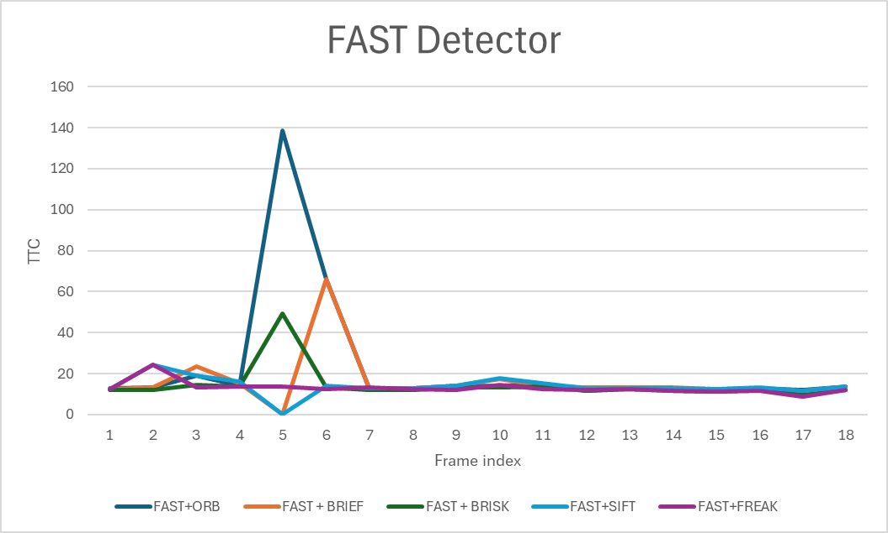
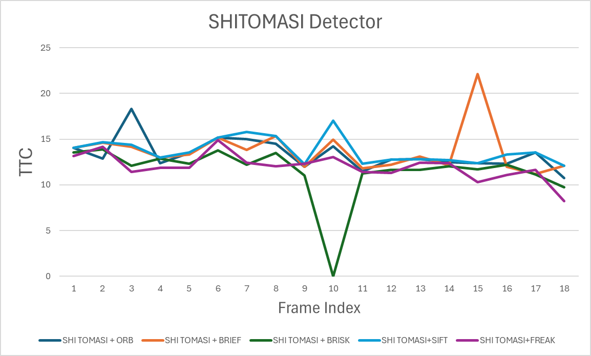
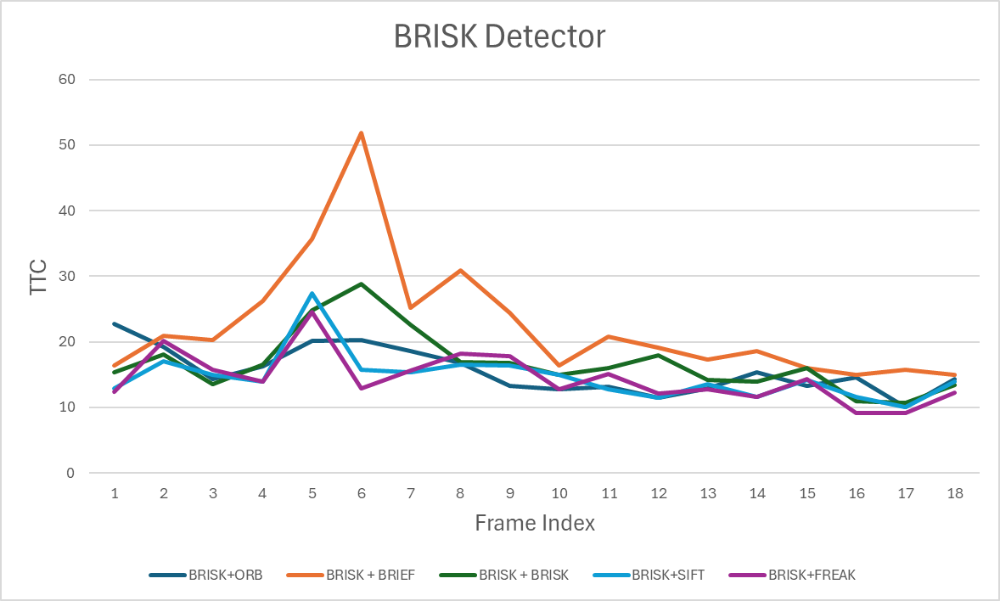
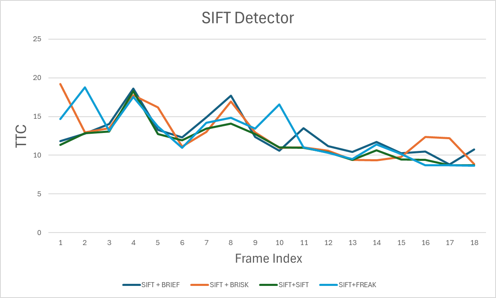
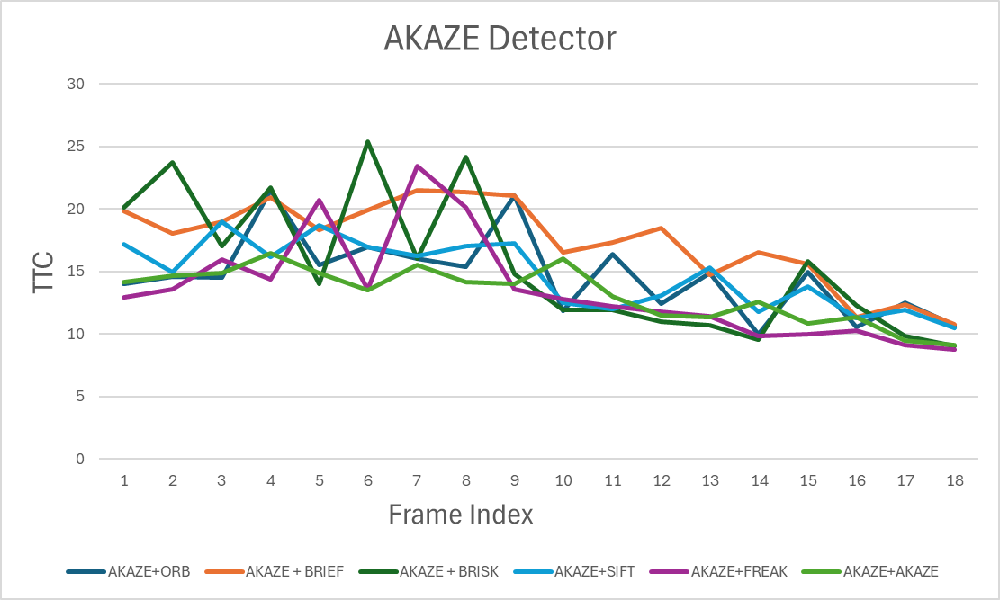

# SFND_Lidar_Camera_TTC_Estimation_FINAL_Project-Report

**FP.1)Bounding Box Matching**

The matchBoundingBoxes function establishes correspondences between bounding boxes in consecutive frames based on keypoint matches.

**Steps and implementation:**

**1)Iterate over keypoint matches**

**Where** for(auto it1=matches.begin(); it1!=matches.end(); it1++)

**What it does:** For each matched keypoint between the previous (prevFrame) and current (currFrame) frames, the function retrieves the corresponding cv::KeyPoint objects (keyprev and keycurr).

**2)Associate keypoints with bounding boxes**

**Where:** Nested loops over prevFrame.boundingBoxes (it2) and currFrame.boundingBoxes (it3)

**What it does:** Checks if the keypoints fall within the ROI of any bounding box. If so, it records the pair of bounding box IDs in a multimap bbmatches.

**3)Count the number of keypoint matches per bounding box pair**

**Where:** for(auto it4=prevFrame.boundingBoxes.begin(); it4!=prevFrame.boundingBoxes.end(); it4++)

**What it does:** For each bounding box in the previous frame, counts how many keypoints matched with each bounding box in the current frame using currcount.

**4)Select the best-matching bounding box**

**Where:** Loop over currcount inside the previous loop

**What it does:** Determines the bounding box in the current frame that has the highest number of matched keypoints. This bounding box is considered the best match for the given previous-frame bounding box.

**5)Store the best matches**

**Where:** bbBestMatches[it4->boxID] = bestmatchboxID

**What it does:** Saves the correspondence between previous and current frame bounding boxes in the bbBestMatches map.

**Summary:**
This function ensures that each bounding box in the previous frame is associated with the most likely corresponding bounding box in the current frame based on keypoint overlap. It is implemented fully in matchBoundingBoxes.cpp in the matchBoundingBoxes function.

**FP.2)TTC Computation from LiDAR**

The computeTTCLidar function calculates the Time-to-Collision (TTC) using LiDAR points from consecutive frames.

**Steps and implementation:**

**1)Filter LiDAR points within the ego lane**

**Where:** Loops over lidarPointsPrev and lidarPointsCurr

**What it does:** Only considers points with lateral distance y within half the lane width (laneWidth/2) to focus on objects in the ego lane. Valid points are stored in vectors XPrev and XCurr.

**2)Handle empty point clouds**

**Where:** if(XCurr.empty() || XPrev.empty())

**What it does:** If no points are left after filtering, TTC cannot be computed, so it is set to NaN.

**3)Compute the median distance**

Where: xprevmedian = median(XPrev) and xcurrmedian = median(XCurr)

What it does: Computes the median of longitudinal distances (x) to reduce the effect of outliers or isolated points.

**4)Check for identical distances**

**Where:** if(xprevmedian == xcurrmedian)

**What it does:** If the median distances in consecutive frames are equal, the relative speed is zero, so TTC is undefined and set to NaN.

**5)Compute TTC**

**Where:** TTC = xcurrmedian * dT / (xprevmedian - xcurrmedian)

**What it does:** Uses the median distances and frame rate (dT = 1/frameRate) to calculate the time remaining before collision under constant velocity assumption.

**Summary:**
This function provides a robust TTC estimate by focusing on points in the ego lane, using median filtering to reduce outlier influence, and handling edge cases where TTC cannot be computed. The entire computation is implemented in the computeTTCLidar function.

**FP.3)Keypoint Association with Bounding Box**

The clusterKptMatchesWithROI function associates a given bounding box with the keypoint matches that lie inside it, and filters out outliers based on euclidean distance.

**Steps and implementation:**

**1)Iterate over keypoint matches**

**Where:** for(auto it1 = kptMatches.begin(); it1 != kptMatches.end(); it1++)

**What it does:** For each match in kptMatches, the corresponding keypoints in the previous (kptsPrev) and current (kptsCurr) frames are retrieved (kptprev and kptcurr).

**2)Check if keypoints lie within the bounding box**

**Where:** if(boundingBox.roi.contains(kptprev.pt) && boundingBox.roi.contains(kptcurr.pt))

**What it does:** Only matches where both keypoints are inside the bounding box ROI are considered valid. These matches are added to boundingBox.kptMatches, and the Euclidean distance between previous and current keypoints is stored in the distances vector.

**3)Handle empty matches**

**Where:** if(distances.empty()) return;

**What it does:** If no keypoints were found inside the bounding box, the function exits early.

**4)Compute mean Euclidean distance**

**Where:**

double sum = 0.0;
for(auto it2 : distances) sum += it2;
double mean = sum / distances.size();

**What it does:** Calculates the mean Euclidean distance of all matches inside the bounding box. This is used to filter out outlier matches.

**5)Filter matches by distance**

**Where:**

for(auto it3 = boundingBox.kptMatches.begin(); it3 != boundingBox.kptMatches.end(); it3++)

{

    const auto &kptprev = kptsPrev[it3->queryIdx];

    const auto &kptcurr = kptsCurr[it3->trainIdx];

    double dist = sqrt((kptcurr.pt.x - kptprev.pt.x)*(kptcurr.pt.x - kptprev.pt.x) +
                       (kptcurr.pt.y - kptprev.pt.y)*(kptcurr.pt.y - kptprev.pt.y));

    if(dist <= mean) filteredmatches.push_back(*it3);

}

boundingBox.kptMatches = filteredmatches;

**What it does:** Retains only matches whose Euclidean distance is less than or equal to the mean. Outlier keypoints are removed, and the filtered matches replace the original boundingBox.kptMatches

**Summary:**
This function robustly associates keypoints with a bounding box while eliminating matches with high euclidean distances, improving the quality of keypoint-based tracking. The entire computation is implemented in the clusterKptMatchesWithROI function.

**FP.4)TTC Computation from Camera**

The computeTTCCamera function calculates the Time-to-Collision (TTC) using keypoint correspondences between successive camera images.

**Steps and implementation:**

**1)Iterate over all keypoint match pairs**

**Where:** Nested loops over kptMatches (it1 and it2)

**What it does:** For each pair of matched keypoints in the current and previous frames, retrieves the corresponding keypoints (kpOuterCurr, kpOuterPrev, kpInnerCurr, kpInnerPrev).

**2)Compute distance ratios**

**Where:** distCurr = cv::norm(...), distPrev = cv::norm(...)

**What it does:** Calculates the distance between keypoints in the current frame (distCurr) and previous frame (distPrev), then computes the distance ratio distCurr / distPrev if distPrev is nonzero and distCurr exceeds a minimum threshold (minDist = 100). These ratios are stored in distRatios.

**3)Handle empty distance ratios**

**Where:** if (distRatios.size() == 0)

**What it does:** If no valid distance ratios are found, TTC cannot be computed, so it is set to NaN.

**4)Compute median distance ratio**

**Where:** Sorting distRatios and selecting the median

**What it does:** Uses the median of distance ratios instead of the mean to reduce the effect of outliers, resulting in a robust estimate.

**5)Compute camera-based TTC**

**Where:** TTC = -dT / (1 - medDistRatio)

**What it does:** Uses the median distance ratio and frame time dT = 1 / frameRate to calculate TTC under the assumption of constant velocity.

**Summary:**
This function provides a robust TTC estimate from camera keypoints by considering distance changes between matched points, filtering out unreliable pairs, and using the median ratio to reduce noise. The computation is fully implemented in the computeTTCCamera function.

**FP.5)Performance Evaluation based on Lidar BASED TTC Computation**

While evaluating Lidar based TTC estimations, several frames were identified where the computed TTC  deviates significantly from a manually estimated TTC derived from  the nearest LiDAR point in top-view. The manual estimation was based on reduction in observed distance between consecutive frames and serves asd a physical reference. Three such frames are discussed below .
    
**1)Frame 4 :** The computed TTC was around 16.68 s but the manual esitmated TTC was observed to be around 7 seconds. Based on Manual calculated TTC The distance reduction is significantly large compared to previous frame  which indicated a strong close motion.

**2)Frame 7 :** The computed TTC was around 12s but the manual esitmated TTC was observed to be around 25 seconds. However, inspection of the top-view LiDAR data shows that the distance to the nearest LiDAR point has in fact decreased compared to the previous frame. This inconsistency indicates that the TTC estimation does not accurately reflect the actual relative motion in this frame.

**3)Frame 12 :** The computed TTC was around 9 sec but the manually estimated TTC was observed to be negative in sign which indicate a increase in distance between ego vehicle and the preceding vehicle. This result contradicts the observed top-view LiDAR measurements, which show a continued reduction in distance to the nearest point on the preceding vehicle. This further highlights the instability of the TTC estimation in certain frames.

The observed discrepancies can be attributed to to several factors which include the following:-

**1)Motion Model Used :** The TTC computation assumes a 'Constant Velocity Model'. On the event of any possible acceleration or decceleration by either the  ego vehicle or by preceding vehicle, this model fails to compute the correct TTC.

**2)Distance calculation Strategy:** The TTC algorithm relys on Median distance of LiDAR points within the bounding box to make it robust against outliers. If only a few points are close to the rear of the vehicle and all other points are lying farrzther away then the median distance will also be larger than true distance , resulting in artificially increased TTC.

**FP.6)PERFORMANCE EVALUATION-CAMERA**

A comparison of different detector–descriptor combinations shows significant differences in the stability of the camera-based TTC estimation.

From the observations we can conclude that various combinations of Decriptors with SIFT, or AKAZE  Detectors gives the best performinfg results in terms of matching reliability. Whereas for real time tasks where speed is a major concern FAST Detector seems to be a good choice  even though performance is slightly reduced, as indicated by a slightly larger standard deviation in TTC estimates.

Similar to TTC estimation using LiDAR, camera-based TTC measurements can exhibit sudden spikes or abrupt variations in the estimated values. Such discrepancies arise from multiple factors, including:

Approximation errors in the constant velocity model, which fail to account for rapid accelerations or decelerations of tracked objects, leading to temporal estimation errors.

Propagation of keypoint localization and tracking errors, caused by image noise, motion blur, and varying illumination conditions, which reduce the reliability of frame-to-frame correspondences and introduce instability in TTC computation.